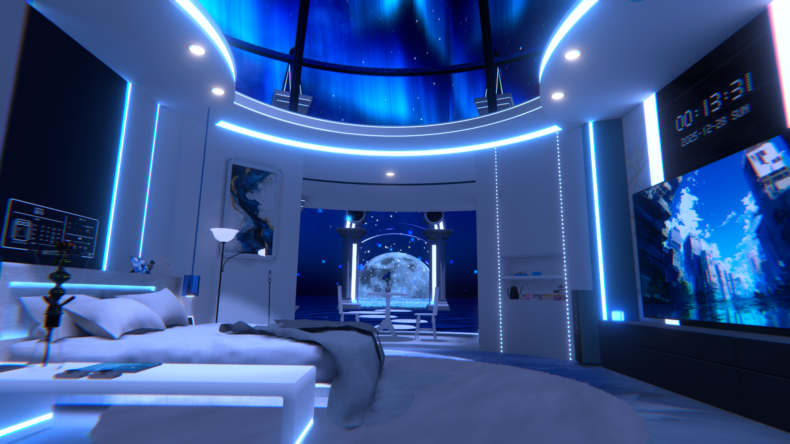

# れふれふ
寒色系・透明感・幻想的な光で彩られた世界観が好き。

個人活動の志

### 「3D空間を彩る光とエフェクトで幻想的な世界観を創り、想像の一歩先の体験を届けるVRChatワールド作家になる」

※主に大学用のGithubアカウントを使用していたため、乗り換えたばかりです。

  

  

## 所属

- 工学部ロボティクス系学部4年生

- Iwaken Lab.

## SNSアカウント

- Note: https://note.com/lef_torenia_lef
- X: https://x.com/lef_clear_lef

## 自己紹介

大学ではロボティクス全般を学びました。

（製図・CAD設計・切削・３Dプリント・ラズパイ・制御工学・流体力学・構造力学・信号処理・電子回路・画像認識・音声認識など）

研究室では、マルチモーダルな音声対話システムのCGエージェント動作制御を行っています。

また、趣味で創作をしています。

（イラスト・DTM・３Dモデリング・VRワールド・エフェクト・Shaderなど）

Shader表現の達人になり、自由自在に３D空間を彩るアーティストになるのが夢です。

## Skills

### Engine

- Unity

### Graphics

- ShaderLab
- HLSL
- URP

### Programing

- C
- C++
- Python

### 3DCG

- Blender
- Substance 3D Painter
- Inventor CAD/CFD

### Design

- Photoshop
- illustrator
- ClipStudioPaint

  

